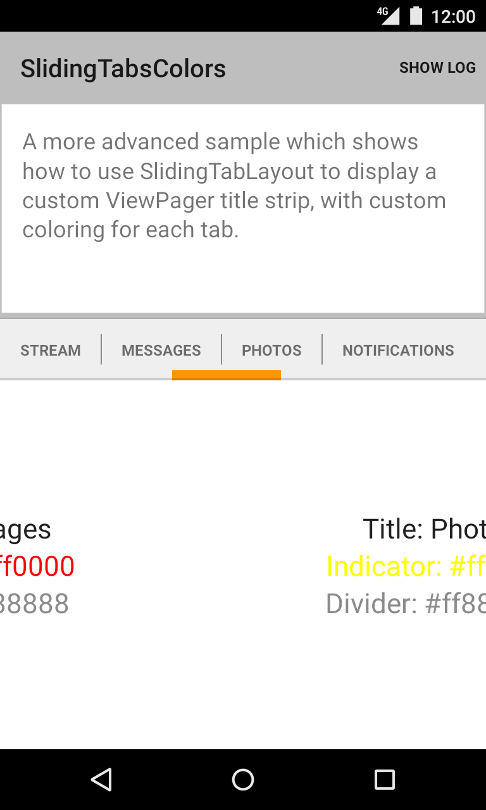
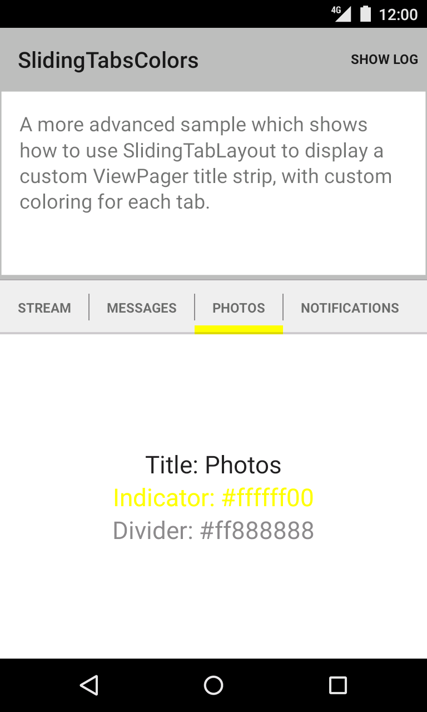

Android SlidingTabsColors Sample
===================================

A more advanced sample which shows how to use SlidingTabLayout to display a custom
ViewPager title strip, with custom coloring for each tab.

Introduction
------------

This sample consists of a custom [HorizontalScrollView][1] called `SlidingTabLayout` that is used
with a [ViewPager][2] to provide a tab indicator component which gives constant feedback as to
the user's scroll progress.

The colors can be customized in two ways. The first and simplest is to provide an
array of colors and the alternative is via the `TabColorizer` interface which gives
complete control over which color is used for any individual position.

The views used as tabs can be customized by calling `setCustomTabView(int, int)` providing the
layout ID of the custom layout.

[1]: http://developer.android.com/reference/android/widget/HorizontalScrollView.html
[2]: http://developer.android.com/reference/android/support/v4/view/ViewPager.html

Pre-requisites
--------------

- Android SDK v23
- Android Build Tools v23.0.0
- Android Support Repository

Screenshots
-------------

   

Getting Started
---------------

This sample uses the Gradle build system. To build this project, use the
"gradlew build" command or use "Import Project" in Android Studio.

Support
-------

- Google+ Community: https://plus.google.com/communities/105153134372062985968
- Stack Overflow: http://stackoverflow.com/questions/tagged/android

If you've found an error in this sample, please file an issue:
https://github.com/googlesamples/android-SlidingTabsColors

Patches are encouraged, and may be submitted by forking this project and
submitting a pull request through GitHub. Please see CONTRIBUTING.md for more details.

License
-------

Copyright 2014 The Android Open Source Project, Inc.

Licensed to the Apache Software Foundation (ASF) under one or more contributor
license agreements.  See the NOTICE file distributed with this work for
additional information regarding copyright ownership.  The ASF licenses this
file to you under the Apache License, Version 2.0 (the "License"); you may not
use this file except in compliance with the License.  You may obtain a copy of
the License at

http://www.apache.org/licenses/LICENSE-2.0

Unless required by applicable law or agreed to in writing, software
distributed under the License is distributed on an "AS IS" BASIS, WITHOUT
WARRANTIES OR CONDITIONS OF ANY KIND, either express or implied.  See the
License for the specific language governing permissions and limitations under
the License.
